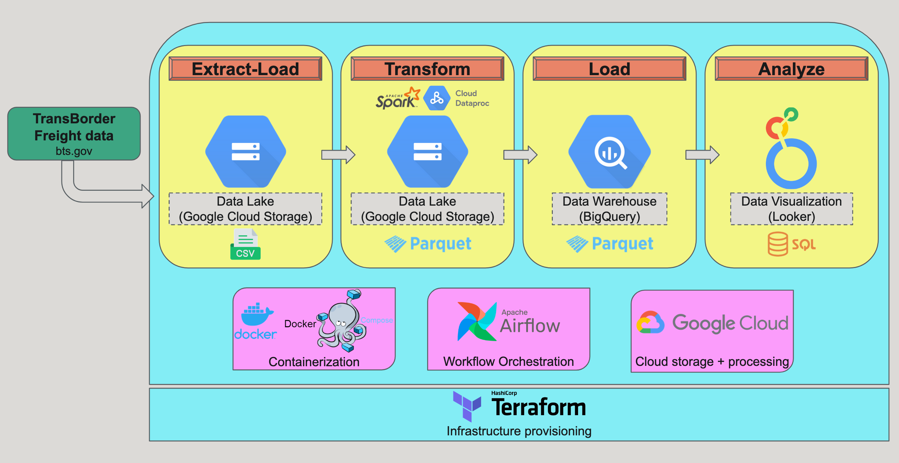

# **Analysis of Transborder freight transport between the USA, Canada and Mexico**

The last few years have witnessed significant developments in North American trade, including the renegotiation of NAFTA into the USMCA, trade tensions and tariff disputes due to changing governments, and the impact of the COVID-19 pandemic. I was interested in analyzing freight transport data to assess the possible effects of these events on trade trends over a decade (2014-2023) between the three biggest countries in North America - USA, Canada and Mexico.

## Objective

My objective was to build a robust data ingestion and processing pipeline that would deliver reliable, reproducible and clean data for analysis, insight generation and potential decision-making regarding North American Transborder trade.

## Technologies

I used the following tools to build the pipeline:

- Terraform for cloud infrastructure provisioning
- Google Cloud Project (GCP) for:
    - data lake storage (Google Cloud Storage, GCS)
    - data warehouse storage (BigQuery)
    - Spark job processing (Dataproc)
    - data visualization + analysis (Looker Studio)
- Docker/Docker Compose for containerization
- Airflow for workflow orchestration
- Apache Spark for distributed batch data processing

## Data description

The raw data is made available by the Bureau of Transportation Statistics (BTS), Department of Transportation (DOT), Government of the United States and can be found here: [Bureau of Transportation Statistics Transborder Freight Raw Data](https://www.bts.gov/topics/transborder-raw-data). It is collected and processed by multiple agencies and organizations (public and private), via multiple approaches including administrative data required by regulation and surveys, from both carriers and shippers. A more thorough description of the data can be found here: [North American Transborder Freight Data FAQs](https://www.bts.gov/statistical-products/transborder-freight-data/north-american-transborder-freight-data-faqs)

The data is in .csv format and is updated on the BTS website on a monthly basis. There is also a metadata file that accompanies the raw data, which details the codes used in the raw data files. The metadata is available in excel and pdf format, with the pdf file containing additional information than what is available in the excel file. Therefore, before using the metadata for this project, I manually curated and reconciled the excel and the pdf files. I’ve used this cleaned up metadata excel file as my input file, available here: [TransBorderCodes.xls](TransBorderCodes.xls)

## Project overview



Overview of the Transborder Freight data processing pipeline

## Project execution

1. Prerequisites: 
You are required to have the following accounts and softwares installed on your system before you can begin:
    - GCP account, GCP project and a service account that has the following permissions to the project:
        - Viewer
        - Storage Admin
        - Storage Object Admin
        - Storage Object Viewer
        - BigQuery Admin
        - Dataproc Administrator
        - Dataprov Service Agent
        - Editor 
    Download the auth-key credentials json file for this service account and save to `~/.google/credentials/google_credentials.json`.
    - Google SDK on local machine
    - Docker desktop and docker compose
    - Terraform

2. Clone this github repo

3. Create a bucket on GCP and copy the file "dataproc-pip-installation.sh" into it using gsutil: 

```
gsutil cp <path-to-dataproc-pip-installation.sh> gs://accessory-bucket-name/scripts/dataproc-pip-installation.sh

```
For example, I've called this bucket "tbf-analysis-accessory", so my code would read:

```
gsutil cp /Users/ahegde/Job_misc/Portfolio/TransBorderFreightAnalysis/VM_project_files/TransBorderFreight-pySpark-BigQuery-Looker/Terraform/dataproc-pip-installation.sh gs://tbf-analysis-accessory/scripts/dataproc-pip-installation.sh
```

The variable "pip_initialization_script" in variables.tf file in the Terraform folder needs to be set to this GCP script path. 

4. Navigate to the Terraform directory. Replace GCP details like project name, bucket name, etc. in the variables.tf file with yours, and set up cloud infrastructure using the following Terraform commands:
    ```
    terraform init
    terraform plan
    terraform apply
    ```

5. Navigate to the Airflow directory, make necessary changes to GCP project name, etc in the docker-compose.yaml and Dockerfile, and run docker compose:
    ```
    docker compose build
    docker compose up airflow-init
    docker compose up
    ```

6. To check whether docker compose has generated all necessary container, you can ssh into the worker container by running:

    ```
    docker ps
    docker exec -it <worker-container-ID> bash
    ```

7. Open `localhost:8080` in a browser and type username:password as admin:admin . You can now trigger your DAG and check the progress as well as the logs.

8. After you're done running the entire project, destroy your cloud resources by running `terraform destroy` inside the Terraform directory (you will need to add the `force_destroy = true` option within your resource blocks in your `main.tf` file if you want Terraform to forcefully destroy the said resources even if you have data stored in the resources. I have switched this off on purpose.)
